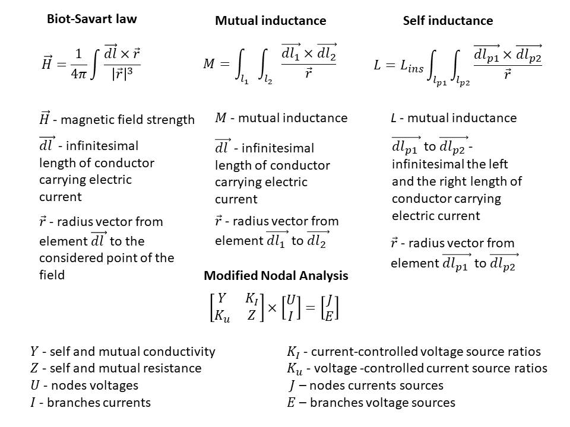
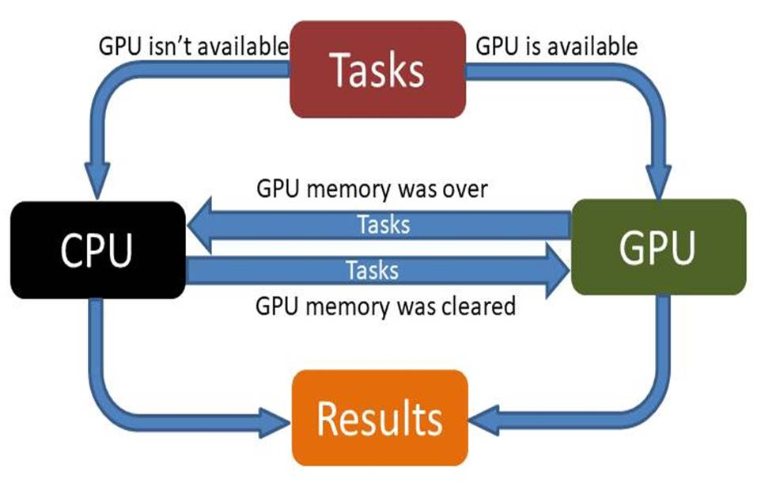

# CalculateMagneticFields 

## Scope of application 
**CalculateMagneticFields** - десктопное приложение, предназначенное для расчёта магнитного поля и наведённых токов в замкнутых контурах с использованием файлов *.dxf* для получения исходных данных и возврата результатов расчётов в системы CAD.

**CalculateMagneticFields** - the desktop application for calculating magnetic fields and induced currents in closed circuits with using *.dxf* files for getting initial data and returning of calculation results into CAD systems.

## Table of contents

  1. [Description](#Description)
  2. [Used technologies](#Used-technologies)
  3. [Installation](#Installation)
  4. [License](#License)

## Description

## Used technologies

- [Python 3.6.2](https://www.python.org/downloads/) - Python programming language interpreter.
- [CUDA Toolkit 10.1](https://developer.nvidia.com/cuda-10.1-download-archive-update2) - The NVIDIA® CUDA® Toolkit provides a development environment for creating high performance GPU-accelerated applications.
- [Numpy 1.15.0](https://pypi.org/project/numpy/1.15.0/) - general-purpose array-processing package designed to efficiently manipulate large multi-dimensional arrays of arbitrary records without sacrificing too much speed for small multi-dimensional arrays.
- [Scipy 1.5.4](https://pypi.org/project/scipy/1.5.4/) - open-source software for mathematics, science, and engineering.
- [Matplotlib 2.2.2](https://pypi.org/project/matplotlib/2.2.2/) - library for interactive graphing, scientific publishing, user interface development and web application servers targeting multiple user interfaces and hardcopy output formats.
- [PyQt5 5.9](https://pypi.org/project/PyQt5/5.9/) - Python binding of the cross-platform GUI toolkit Qt, implemented as a Python plug-in.
- [Openpyxl 2.4.8](https://pypi.org/project/openpyxl/2.4.8/) - Python library to read/write Excel 2010 xlsx/xlsm/xltx/xltm files.
- [PyTorch 1.3.0+cuda 10.1](https://download.pytorch.org/whl/cu101/torch-1.3.0-cp36-cp36m-win_amd64.whl) - PyTorch is a Python package that provides two high-level features: Tensor computation (like NumPy) with strong GPU acceleration and Deep neural networks built on a tape-based autograd system.
- [Ezdxf 0.14.2](https://pypi.org/project/ezdxf/0.14.2/) - Python package to create and modify DXF drawings, independent from the DXF version.
- [Pynvml 8.0.3](https://pypi.org/project/pynvml/8.0.3/) - Provides a Python interface to Nvidia GPU management and monitoring functions.

## Installation 
Для того чтобы использовать данное приложение необходимо установить компоненты с раздела [Used technologies](#Used-technologies). Первоначально установите интерпретатор Python, а затем при помощи пакетного менеджера *Pip* установите перечисленные пакеты. При применении версий пакетов отличных от предложенных работоспособность приложения не гарантируется.

For using the application necessity to install components from section [Used technologies](#Used-technologies). First of all install Python interpreter, and after that using package manager *Pip* to install listed packages. In case using versions of packages that differ from the proposed, correct work of the application is not ensured.

        pip install -r requirements.txt

## License 
Licensed under the [MIT](LICENSE.txt) license.	
