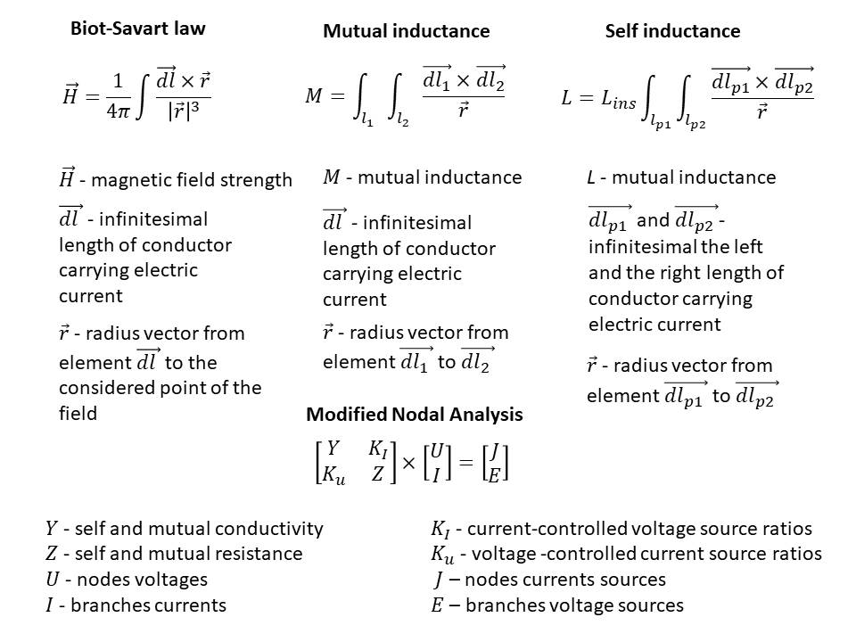
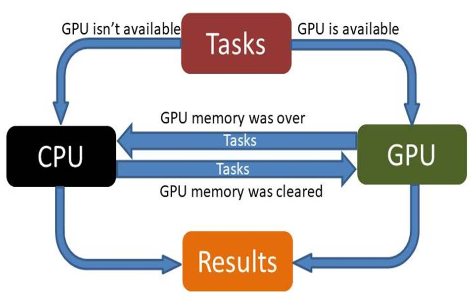
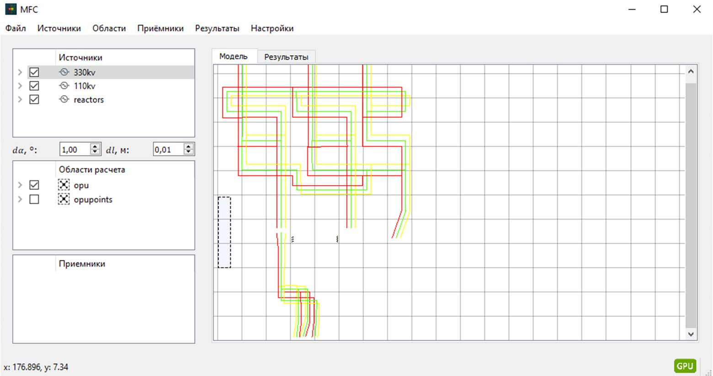
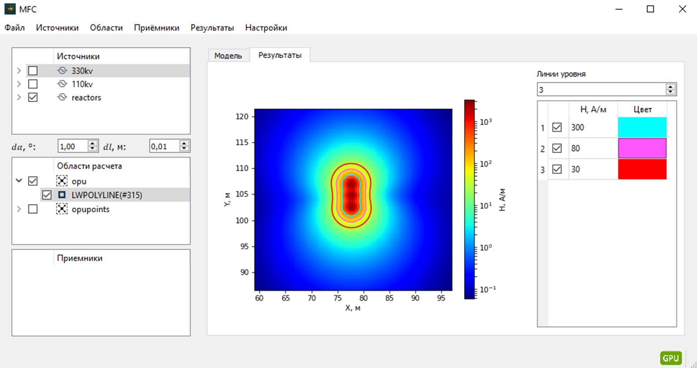
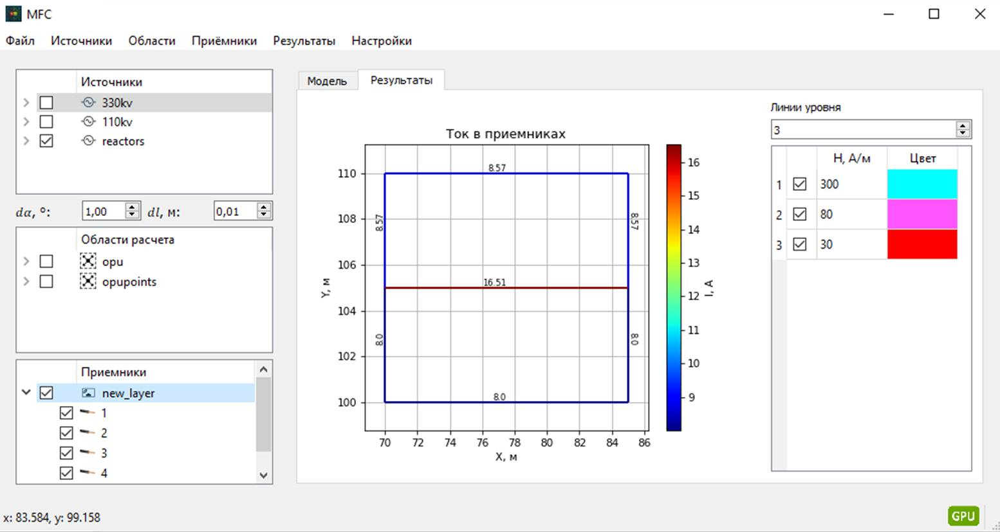

# CalculateMagneticFields 

## Scope of application 

**CalculateMagneticFields** - the desktop application for calculating magnetic fields and induced currents in closed circuits with using *.dxf* files for getting initial data and returning of calculation results into CAD systems.

## Table of contents

  1. [Description](#Description)
  2. [Used technologies](#Used-technologies)
  3. [Installation](#Installation)
  4. [License](#License)

## Description

To provide electromagnetic compatibility of technical means of electric industry objects it's necessary to do some acts to check electromagnetic environment and if electromagnetic compatibility wasn't provided, it's necessary to do actions that will make required compatibility. In case designing of electric industry objects calculating are a singular way of definition electromagnetic environment.

One of a conditions of electromagnetic compatibility is values of magnetic field strength near technical means don't have to be  more than admissible, what in case of designing creates necessary to calculate values of magnetic field strength. It was main reason of developing the app.

In this app for calculating of magnetic field strength, self and mutual inductance of free-form conductors and electric circuits is used following mathematical expressions:

How we see, expressions for calculating of magnetic field strength, self and mutual inductance of free-form conductors is integral expressions, that makes volume of calculations very big. So calculating for some area in case lots of sources of magnetic field or calculating self and mutual inductance for lots of elements can spend too much time, that isn't convenient.

So for optimization time spending GPU calculating are used. It is possible in case using GPU from NVIDIA with CUDA cores, a development environment for creating high performance GPU-accelerated applications by [CUDA Toolkit](https://developer.nvidia.com/cuda-10.1-download-archive-update2), [PyTorch](https://pytorch.org/) package that provides tensor computation (like NumPy) with strong GPU acceleration. In case absence of GPU, application runs calculations on CPU.

Before running calculations on GPU it's necessary to move initial data from computer RAM into GPU RAM. Volume of GPU RAM usually less than computer RAM, and also doesn't have swap files. So it's necessary to check memory size that is needed for calculating. Thus performing calculations are separated on lots of tasks, which are distributed and solved following way:

How we see, in case GPU availability all tasks to which GPU has enough memory is calculated with GPU and other tasks are sent for calculating to CPU, when GPU solve all tasks CPU will send back maximum amount of tasks to GPU. In case GPU absence calculation is run only with СPU. As GPU memory can be used by other apps besides this application, so it's necessary check size of available memory, because its overflow will throw error. For it is used [Pynvml](https://pypi.org/project/pynvml/8.0.3/) library which allow to monitor different GPU parameters.

The application GUI was made with [PyQt5](https://pypi.org/project/PyQt5/5.9/) library. The application window has two main parts: part for showing current sources and receivers magnetic field and calculating areas, and also part for showing geometrical arrangement of elements and calculating results.

For showing of calculating results of magnetic field strength for some area is used [Matplotlib](https://pypi.org/project/matplotlib/2.2.2/) library which allow to create color plots for z = f(x, y) functions. Besides it in the right column we can set options (value of magnetic field strength and line color) for creating level lines which show zones that have magnetic field strength values more than in options.

Calculating of induced currents in close circuits is done with [Numpy](https://pypi.org/project/numpy/1.15.0/) и [Scipy](https://pypi.org/project/scipy/1.5.4/) libraries. Showing of results also is done with plot, which shows geometrical arrangement of conductors and currents modules flowing in it, and also there is light indication for current value, which is shown with line color settings.

The application also can read initial data from *.dxf* files that are created by CAD and write result of calculatings into *.dxf*. For work with *.dxf* files is used [Ezdxf](https://pypi.org/project/ezdxf/0.14.2/) library. This way is very convenient, because instead input geometrical arrangement of elements, we can read them from *.dxf* and output of calculating results into *.dxf* allows to show them on drawings without hand work.

## Used technologies

- [Python 3.6.2](https://www.python.org/downloads/) - Python programming language interpreter.
- [CUDA Toolkit 10.1](https://developer.nvidia.com/cuda-10.1-download-archive-update2) - The NVIDIA® CUDA® Toolkit provides a development environment for creating high performance GPU-accelerated applications.
- [Numpy 1.15.0](https://pypi.org/project/numpy/1.15.0/) - general-purpose array-processing package designed to efficiently manipulate large multi-dimensional arrays of arbitrary records without sacrificing too much speed for small multi-dimensional arrays.
- [Scipy 1.5.4](https://pypi.org/project/scipy/1.5.4/) - open-source software for mathematics, science, and engineering.
- [Matplotlib 2.2.2](https://pypi.org/project/matplotlib/2.2.2/) - library for interactive graphing, scientific publishing, user interface development and web application servers targeting multiple user interfaces and hardcopy output formats.
- [PyQt5 5.9](https://pypi.org/project/PyQt5/5.9/) - Python binding of the cross-platform GUI toolkit Qt, implemented as a Python plug-in.
- [Openpyxl 2.4.8](https://pypi.org/project/openpyxl/2.4.8/) - Python library to read/write Excel 2010 xlsx/xlsm/xltx/xltm files.
- [PyTorch 1.3.0+cuda 10.1](https://download.pytorch.org/whl/cu101/torch-1.3.0-cp36-cp36m-win_amd64.whl) - PyTorch is a Python package that provides two high-level features: Tensor computation (like NumPy) with strong GPU acceleration and Deep neural networks built on a tape-based autograd system.
- [Ezdxf 0.14.2](https://pypi.org/project/ezdxf/0.14.2/) - Python package to create and modify DXF drawings, independent from the DXF version.
- [Pynvml 8.0.3](https://pypi.org/project/pynvml/8.0.3/) - Provides a Python interface to Nvidia GPU management and monitoring functions.

## Installation 

For using the application necessity to install components from section [Used technologies](#Used-technologies). First of all install Python interpreter and CUDA Toolkit 10.1, and after that using package manager *Pip* will run following line:

        pip install -r requirements.txt

In case using versions of packages that differ from the proposed, correct work of the application is not ensured.

## License 
Licensed under the [MIT](LICENSE.txt) license.	
